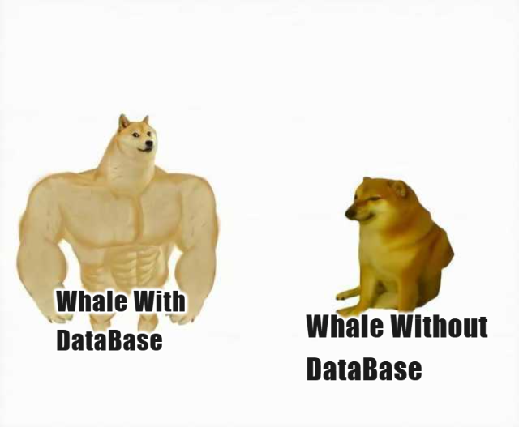
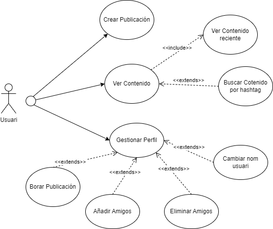
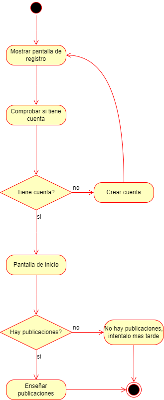
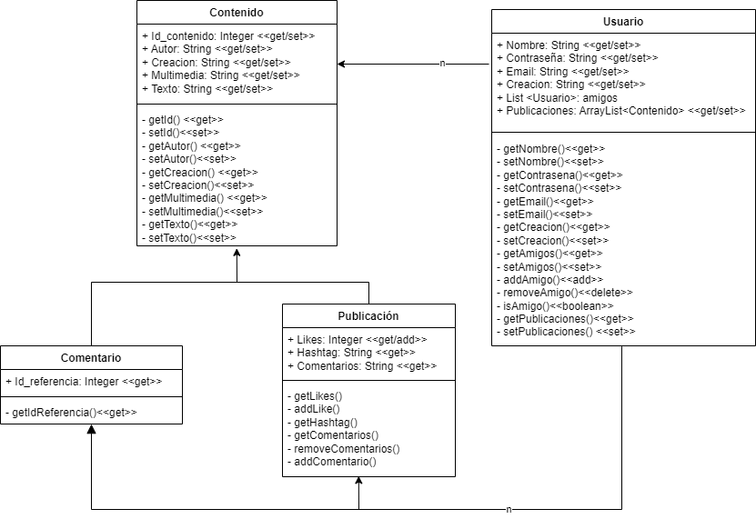
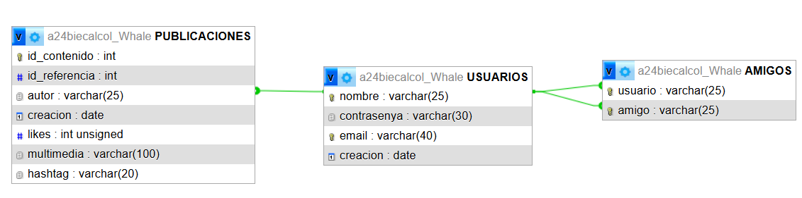

  

# Whale

## Tabla de Contenidos  
- [Descripción](#descripcion) 
- [Caracteristicas Principales](#características-principales)
- [Guía de Uso](#guía-de-uso)
- [Diagramas](#diagramas)  

## Descripcion

Whale es un proyecto en [Java](https://www.java.com/es/) para la creación de una red social básica. 🐋🐋

Actualmente, se encuentra en su fase inicial, y su propósito es ofrecer funcionalidades esenciales para los usuarios, como la creación y modificación de perfiles, añadir y eliminar publicaciones y un sistema sencillo de amigos.

La idea es hacer una mezcla parecida a [reddit](https://www.reddit.com/?rdt=51627), [twitter](https://x.com/?lang=es), almacenar los datos en una base de datos de [MySQL](https://www.mysql.com/) y dar un toque personal y original
a [futuro](#futuras-actualizaciones), planeamos mejorarla añadiendo nuevas características y actualizaciones originales.

## Características principales

### ¿Qué es Whale? 

- Puedes gestionar tu lista de amigos tanto para eliminarlos como para añadirlos.
- Puedes interactuar con las publicaciones (like y comentar) y crear contenido usando hashtag.
- Todos los datos del usuario están en estado privado, guardados en una base de datos de [MySQL](https://www.mysql.com/) y únicamente tiene acceso el equipo de desarrollo
- Los usuarios pueden publicar tanto texto, imagenes o las dos a la vez.
- Los usuarios pueden personalizar su perfil añadiendo un nombre de usuario y añadiendo publicaciones, comentarios o likes a otras publicaciones.

### Aclaraciones

Whale es un proyecto hecho por estudiantes, por lo que no és (por el momento) un aplicación que se pueda comparar ni con facebook ni instagram, en forma de práctica hemos intentado hacer una red social y podemos afirmar con seguridad que tiene buenas prácticas de código, mucho tiempo invertido y sobre todo muchas vueltas de cabeza para poder desarrollarla correctamente.

## Guía de uso

Al iniciar el programa podrás iniciar sesión usando un nombre de usuario o correo electrónico que están almacenadas en la base de datos de la aplicación y si no tienes cuenta habrá una opción para registrarte.
Una cuenta ya creada sería `juan123` : `password123`.
A continuación se vería todas las publicaciones divididas por páginas (como un foro), y puedes modificar tu perfil, filtrar tu contenido por hashtags de otras publicaciones, añadir publicaciones o seleccionar otras publicaciones de otros usuarios para comentarles o dar likes.
Recomiendo que pruebe las diferentes versiones que hay con el sistema de datos de Whale, con ficheros, base de datos, o ambas la aplicación sigue funcioanndo correctamente.

## Diagramas

Diagrama de Casos de Uso
<picture>
  <source srcset="./diag/png/cu.drawio.light.png" media="(prefers-color-scheme: light)">
  <source srcset="./diag/png/cu.drawio.black.png" media="(prefers-color-scheme: dark)">
  
</picture>

Diagrama de Actividades
<picture>
  <source srcset="./diag/png/da.drawio.light.png" media="(prefers-color-scheme: light)">
  <source srcset="./diag/png/da.drawio.black.png" media="(prefers-color-scheme: dark)">
  
</picture>

Diagrama de Clases
<picture>
  <source srcset="./diag/png/dc.drawio.light.png" media="(prefers-color-scheme: light)">
  <source srcset="./diag/png/dc.drawio.black.png" media="(prefers-color-scheme: dark)">
  
</picture>

### Tablas Relacionadas Base de Datos

## Creado por
- Martí Castaño Rodríguez, 1º DAM
- Biel Calvet Colomé, 1º DAM

Iniciado como marca registrada el 19/02/2025. Whale©.