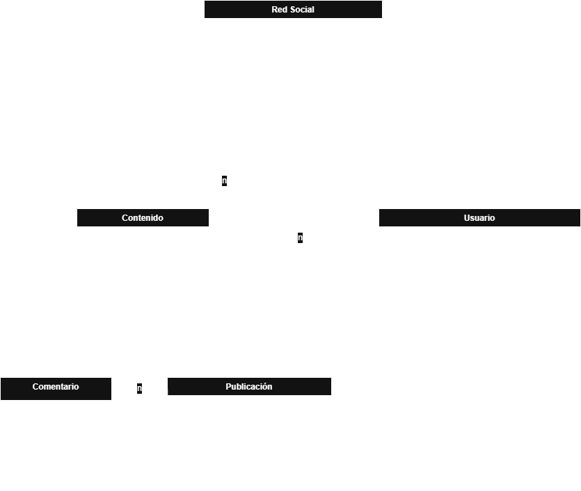

# Whale

## Tabla de Contenidos  
- [Descripción](#descripción)  
- [Guía de Uso](#guia-de-uso)  
- [Futuras Actualizaciones](#futuras-actualizaciones)  

## Descripción  

Whale es un proyecto en  [Java](https://www.java.com/es/) para la creación de una red social básica. 

Actualmente, se encuentra en su fase inicial, y su propósito es ofrecer funcionalidades esenciales para los usuarios, como la creación de perfiles y un sistema sencillo de amigos. 

La idea es hacer una mezcla parecida a [reddit](https://www.reddit.com/?rdt=51627), [twitter](https://x.com/?lang=es) y un toque personal y original
A [futuro](#futuras-actualizaciones), planeamos mejorarla añadiendo nuevas características y actualizaciones originales.  

### Características principales  

1. **Creación de perfiles**  
   - Los usuarios pueden registrarse y personalizar su perfil añadiendo un nombre de usuario.  
   - Por el momento, no se utiliza ninguna base de datos; los usuarios serán moderados manualmente.  

2. **Conexión entre usuarios y contenido**  
   - Los usuarios pueden agregar amigos y seguir a otros.  
   - Permite publicar diversos tipos de contenido, como textos, imágenes, videos y enlaces.  

## Guia de uso  

Actualmente en desarrollo.  
Se incluirán instrucciones detalladas en futuras versiones.  

### Diagrama de Casos de Uso

### Diagrama de Actividades

### Diagrama de Clases

## Futuras Actualizaciones  

- A pesar de que es difícil, buscar la opción de tener un almacenamiento de toda la información estaria genial en un futuro.
- Añadir la posibilidad de ver el contenido en una plataforma o página web.

## Creado por  
- Martí Castaño Rodríguez, 1º DAM  
- Biel Calvet Colome, 1º DAM  

Iniciado como marca registrada el 19/02/2025. Whale©.